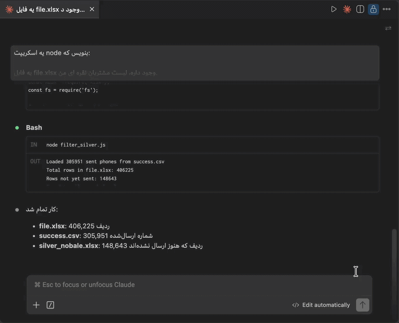
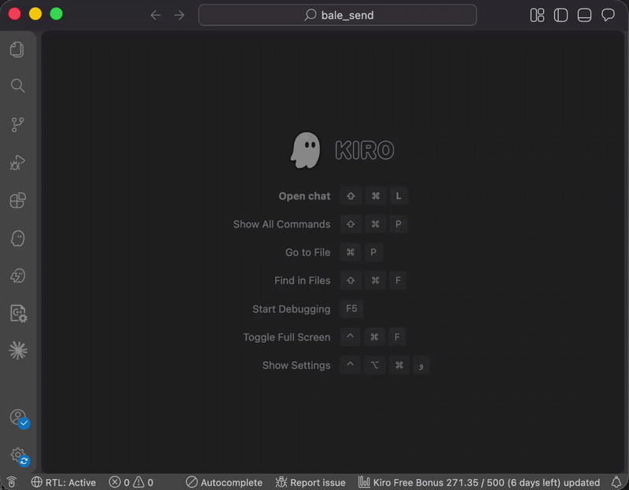

# Claude Code RTL Support

> **Adds Right-to-Left (RTL) text support for Hebrew, Arabic & Persian to Claude Code in VS Code, Cursor & Antigravity.**

---

## 🌐 Languages | שפות | اللغات | زبان‌ها

| | Language | Quick Links |
|---|---|---|
| 🇺🇸 | English | [View Extension Explanation ↓](#english) |
| 🇮🇱 | עברית | [להסבר על התוסף בעברית ↓](#hebrew) |
| 🇸🇦 | عربية | [لشرح الملحق بالعربية ↓](#arabic) |
| 🇮🇷 | فارسی | [برای توضیح افزونه به فارسی ↓](#persian) |

---

### 🎬 Demo

<details open>
    <summary>🖼️ RTL <strong>⇄</strong> Button</summary>
    
</details>
<details>
    <summary>🖼️ Status Bar</summary>
    
</details>

<a id="english"></a>

[🔝 Back to top](#claude-code-rtl-support)

## 🇺🇸 English

A VS Code extension that adds Right-to-Left (RTL) text direction support to the **Claude Code** chat interface in VS Code, Cursor, and Antigravity. Designed for Hebrew, Arabic, and Persian speakers who want natural text alignment when chatting with Claude — without affecting code blocks or UI elements.

### 🤔 Why is this needed?

The original Claude Code for VS Code extension lacks native RTL support. This often results in:

- ❌ Hebrew, Arabic, and Persian text appearing misaligned
- ❌ Difficulty reading mixed-language conversations (code + RTL text)
- ❌ Inconsistent UI behavior in the chat panel

**Claude Code RTL Support** fixes these issues by intelligently injecting CSS to handle text direction — while strictly preserving LTR for code blocks and terminal outputs.

### ✨ Features

| Feature | Description |
|---|---|
| ▶️ Activate RTL | Injects CSS and a toggle button into the Claude Code chat |
| 📌 Activate RTL (Always) | Permanently enables RTL without a toggle button |
| 👁️ Activate RTL (Auto) | Auto-detects Hebrew/Arabic/Persian per bubble and sets direction |
| 🔧 Fix BiDi | Activates RTL and fixes reversed text (e.g. "םולש" → "שלום") |
| ⏹️ Deactivate RTL | Restores original files from backup |
| 🔍 Check Status | Shows which installations have RTL enabled |
| 📊 Status Bar | Shows current RTL state at a glance — click to manage |
| 🔄 Auto-reactivate | Automatically restores RTL after Claude Code updates |
| 🔤 Font settings | Customize font for text areas and code blocks separately |

---

### 🆕 What's New (v0.3.7)

- **Kiro IDE support** — The extension now detects and supports Kiro alongside VS Code, Cursor, and Antigravity.
- **Font customization** — Set separate fonts for text areas and code blocks via `claude-rtl.textFont` and `claude-rtl.codeFont` settings.
- **Antigravity IDE support** — The extension now detects and supports Antigravity alongside VS Code and Cursor.

<details>
<summary><strong>Previous versions</strong></summary>

#### v0.3.6

- **Smart input direction** — The input field now detects text direction on the fly based on the first character you type. Start with a Hebrew, Arabic, or Persian letter and it flows RTL; start with English and it stays LTR. The only exception is **Active** mode with the ⇄ button toggled on — there the input is always RTL.
- **Fallback button placement** — When the chat header isn't rendered yet (e.g. resuming an active session on startup), the ⇄ toggle button now appears above the input area so you're never left without it.
- **Safer auto-reactivate** — Version tracking ensures RTL is cleanly re-injected after a Claude Code update instead of stacking on stale CSS.

#### v0.3.5

- **Auto RTL mode** — An intelligent mode that auto-detects Hebrew, Arabic, and Persian text per chat bubble using a MutationObserver. Only bubbles containing RTL text get right-to-left direction — English-only bubbles stay LTR. No manual toggling needed.

#### v0.3.0

- **Always RTL mode** — A new mode that permanently enables RTL without needing the toggle button. CSS is injected directly without class dependency, so RTL is always active. Switch between modes via the status bar menu or command palette.
- **Auto-reactivate** — RTL is automatically restored when Claude Code updates replace its files. No need to manually re-activate.
- **Auto-activate on install** — RTL activates automatically on first install.

#### v0.2.0

- **Fix BiDi command** — Solves the reversed text issue where Hebrew/Arabic/Persian words appear mirrored (e.g. "םולש" instead of "שלום"). This happens because Claude Code injects a `*{direction:ltr;unicode-bidi:bidi-override}` rule that forces all text to LTR. The new **Fix BiDi** command activates RTL and removes this problematic rule automatically.

</details>

---

### 📋 Requirements

- [**Claude Code for VS Code**](https://marketplace.visualstudio.com/items?itemName=anthropic.claude-code) (`anthropic.claude-code`) — installed automatically as a dependency

---

### 💻 Supported Platforms

| 🛠️ IDEs |
|---|
| VS Code |
| Cursor |
| Antigravity |
| Kiro |

---

### 🚀 How to Use

#### 📊 Option 1: Status Bar

After installation, a status bar item appears at the bottom of VS Code:

| Status | Meaning |
|---|---|
| `RTL: Active` ✅ | RTL is injected with toggle button |
| `RTL: Always` 📌 | RTL is permanently on (no toggle needed) |
| `RTL: Auto` 👁️ | RTL auto-detects per bubble |
| `RTL: Inactive` ⭕ | RTL is not installed |
| `RTL: N/A` ❌ | Claude Code for VS Code extension not found |

**Click the status bar item** to open a menu with Activate / Activate (Always) / Deactivate / Status options.

#### 🎯 Option 2: Command Palette

Press `Ctrl+Shift+P` (or `Cmd+Shift+P` on macOS) and search for:

| Command | Action |
|---|---|
| `Claude RTL: Activate RTL` | ▶️ Enable RTL support with toggle button |
| `Claude RTL: Activate RTL (Always)` | 📌 Enable RTL permanently without toggle button |
| `Claude RTL: Activate RTL (Auto)` | 👁️ Auto-detect RTL per bubble |
| `Claude RTL: Fix BiDi` | 🔧 Activate RTL + fix bidirectional text issues |
| `Claude RTL: Deactivate RTL` | ⏹️ Disable RTL and restore original files |
| `Claude RTL: Check Status` | 🔍 View installation status |

> 🔄 **The window reloads automatically** after Activate / Deactivate to apply changes.

#### 💬 Using RTL in Chat

**Active mode** — After activating RTL and reloading:

1. Open the Claude Code chat panel
2. Click the **⇄** button in the chat header
3. The interface switches to RTL — text aligns to the right
4. Click again to return to LTR

**Always mode** — RTL is permanently on. No button needed — text is always right-to-left.

**Auto mode** — RTL is automatically detected per chat bubble. Bubbles with Hebrew/Arabic/Persian text become RTL; English-only bubbles stay LTR. Best for mixed-language conversations.

> 💡 **Tip (Active mode):** Not every conversation needs RTL — you can toggle it per chat session.
> Use ⇄ only in conversations where you write in Hebrew, Arabic, or Persian.

> 💡 **Tip (Always mode):** Use this if you always write in Hebrew, Arabic, or Persian and don't want to toggle each time.

> 💡 **Tip (Auto mode):** Best for mixed conversations — each bubble gets the right direction automatically.

> 🔄 **Auto-reactivate:** If Claude Code updates and replaces its files, RTL is automatically restored on the next startup.

---

### ⚙️ Font Settings

Customize the fonts used in Claude Code by adding settings to your `settings.json` (`Cmd+,` → search `claude-rtl`):

| Setting | Description | Example |
|---|---|---|
| `claude-rtl.textFont` | Font for text, messages, and the input box | `Vazirmatn`, `Tahoma` |
| `claude-rtl.codeFont` | Font for code blocks | `JetBrains Mono`, `Fira Code` |

```json
{
  "claude-rtl.textFont": "Vazirmatn",
  "claude-rtl.codeFont": "JetBrains Mono"
}
```

> 💡 Leave a setting empty to keep the original Claude Code font.
>
> 🔄 Changing a font setting automatically re-injects the CSS and reloads the window.

---

### ↔️ What Changes in RTL Mode?

| ✅ Becomes RTL | 🔒 Stays LTR |
|---|---|
| User messages | Code blocks |
| Claude's text responses | Tool calls and results |
| Lists and paragraphs | Thinking blocks |
| Question/answer blocks | Slash commands |
| | Buttons and UI elements |

---

### 🔧 Troubleshooting

<details>
<summary><strong>❓ Can't find the plugin in Cursor or Antigravity</strong></summary>

- Search for the plugin by its ID: `claude-code-rtl`
- The display name "Claude Code RTL Support" may not appear in search results on all platforms
- Use the exact ID `claude-code-rtl` in the extensions search bar

</details>

<details>
<summary><strong>❓ Extension doesn't find Claude Code for VS Code</strong></summary>

- Make sure the "Claude Code for VS Code" extension is installed
- Check status with the `Claude RTL: Check Status` command

</details>

<details>
<summary><strong>❓ Changes not visible after activating</strong></summary>

- Reload the window: `Ctrl+Shift+P` → `Developer: Reload Window`
- Or close and reopen VS Code / Cursor completely

</details>

<details>
<summary><strong>❓ RTL stopped working after a Claude Code update</strong></summary>

- When "Claude Code for VS Code" updates, it replaces its files and RTL support is removed
- Starting from v0.3.0, RTL is **automatically restored** on the next startup
- If it doesn't restore automatically, run **Claude RTL: Activate RTL** manually

</details>

<details>
<summary><strong>❓ Hebrew/Arabic text appears reversed (e.g. "םולש" instead of "שלום")</strong></summary>

- This is caused by a `bidi-override` CSS rule in Claude Code that forces LTR direction on all text
- Use **Claude RTL: Fix BiDi** instead of **Activate RTL** to fix this
- Note: Running **Activate RTL** again will bring back the issue — use **Fix BiDi** each time

</details>

<details>
<summary><strong>❓ Permission Denied error</strong></summary>

- **Windows:** Try running VS Code as Administrator
- **macOS / Linux:** Check file permissions on the extensions directory

</details>

---

### 📄 License

MIT — see [LICENSE](LICENSE) for details.

[🔝 Back to top](#claude-code-rtl-support)

---

<a id="hebrew"></a>

<div dir="rtl" lang="he">

[🔝 חזרה למעלה](#claude-code-rtl-support)

## 🇮🇱 עברית

תוסף ל-VS Code שמוסיף תמיכת כיווניות מימין לשמאל (RTL) לממשק הצ'אט של **Claude Code for VS Code**. מיועד לדוברי עברית, ערבית ופרסית שרוצים יישור טקסט טבעי בשיחה עם Claude — מבלי לפגוע בבלוקי קוד או ברכיבי הממשק.

### 🤔 למה זה נחוץ?

תוסף Claude Code for VS Code המקורי חסר תמיכת RTL מובנית. הדבר גורם לעיתים קרובות ל:

- ❌ טקסט עברי, ערבי ופרסי שמוצג בצורה לא מיושרת
- ❌ קושי בקריאת שיחות בשפות מעורבות (קוד + טקסט RTL)
- ❌ התנהגות ממשק לא עקבית בפאנל הצ'אט

**Claude Code RTL Support** פותר בעיות אלה על ידי הזרקה חכמה של CSS לטיפול בכיווניות הטקסט — תוך שמירה קפדנית על LTR עבור בלוקי קוד ופלטי טרמינל.

### ✨ תכונות

| תכונה | תיאור |
|---|---|
| ▶️ הפעלת RTL | מזריק עיצוב CSS וכפתור מתג לממשק הצ'אט |
| 📌 הפעלת RTL (תמיד) | מפעיל RTL לצמיתות ללא כפתור מתג |
| 👁️ הפעלת RTL (אוטו) | מזהה אוטומטית עברית/ערבית/פרסית לכל בועה וקובע כיוון |
| 🔧 תיקון BiDi | מפעיל RTL ומתקן טקסט הפוך (למשל "םולש" → "שלום") |
| ⏹️ כיבוי RTL | משחזר קבצים מקוריים מגיבוי |
| 🔍 בדיקת סטטוס | מציג אילו התקנות פועלות עם RTL |
| 📊 שורת מצב | מציג את המצב הנוכחי בתחתית המסך — לחץ לניהול |
| 🔄 הפעלה מחדש אוטומטית | משחזר RTL אוטומטית לאחר עדכון Claude Code |
| 🔤 הגדרות גופן | התאמה אישית של גופן לאזורי טקסט ובלוקי קוד בנפרד |

---

### 🆕 מה חדש (v0.3.7)

- **תמיכה ב-Kiro IDE** — התוסף מזהה ותומך כעת ב-Kiro לצד VS Code, Cursor ו-Antigravity.
- **התאמת גופן** — הגדרת גופן נפרד לאזורי טקסט ולבלוקי קוד דרך `claude-rtl.textFont` ו-`claude-rtl.codeFont`.
- **תמיכה ב-Antigravity IDE** — התוסף מזהה ותומך כעת ב-Antigravity לצד VS Code ו-Cursor.

<details>
<summary><strong>גרסאות קודמות</strong></summary>

#### v0.3.6

- **כיוון חכם בשדה הקלט** — שדה הקלט מזהה עכשיו את כיוון הטקסט בזמן אמת לפי התו הראשון שמקלידים. מתחילים באות עברית, ערבית או פרסית — הטקסט זורם ימינה; מתחילים באנגלית — נשאר שמאלה. היוצא מן הכלל הוא מצב **Active** כשכפתור ⇄ לחוץ — אז הקלט תמיד RTL.
- **מיקום חלופי לכפתור** — כשהכותרת של הצ'אט עדיין לא נטענה (למשל בחזרה לשיחה פעילה עם הפעלה), כפתור ⇄ מופיע מעל שדה הקלט כדי שתמיד יהיה נגיש.
- **הפעלה מחדש אוטומטית בטוחה יותר** — מעקב אחר גרסה מבטיח שה-RTL מוזרק מחדש בצורה נקייה לאחר עדכון Claude Code במקום להיערם על CSS ישן.

#### v0.3.5

- **מצב RTL אוטומטי** — מצב חכם שמזהה אוטומטית טקסט בעברית, ערבית ופרסית לכל בועת צ'אט באמצעות MutationObserver. רק בועות שמכילות טקסט RTL מקבלות כיווניות מימין לשמאל — בועות באנגלית בלבד נשארות LTR. ללא צורך בהחלפה ידנית.

#### v0.3.0

- **מצב RTL תמידי** — מצב חדש שמפעיל RTL לצמיתות ללא צורך בכפתור מתג. ה-CSS מוזרק ישירות ללא תלות ב-class, כך ש-RTL תמיד פעיל. ניתן לעבור בין מצבים דרך תפריט שורת המצב או לוח הפקודות.
- **הפעלה מחדש אוטומטית** — RTL משוחזר אוטומטית כאשר עדכון Claude Code מחליף את הקבצים. אין צורך להפעיל ידנית מחדש.
- **הפעלה אוטומטית בהתקנה** — RTL מופעל אוטומטית בהתקנה ראשונה.

#### v0.2.0

- **פקודת Fix BiDi** — פותרת את בעיית הטקסט ההפוך שבה מילים בעברית/ערבית/פרסית מופיעות מראה (למשל "םולש" במקום "שלום"). זה קורה כי Claude Code מזריק כלל CSS בעייתי `*{direction:ltr;unicode-bidi:bidi-override}` שכופה כיוון LTR על כל הטקסט. הפקודה החדשה **Fix BiDi** מפעילה RTL ומסירה את הכלל הבעייתי אוטומטית.

</details>

---

### 📋 דרישות

- [**Claude Code for VS Code**](https://marketplace.visualstudio.com/items?itemName=anthropic.claude-code) — מותקן אוטומטית כתלות

---

### 💻 פלטפורמות נתמכות

| 🛠️ סביבות פיתוח |
|---|
| VS Code |
| Cursor |
| Antigravity |
| Kiro |

---

### 🚀 איך להשתמש

#### 📊 אפשרות 1: שורת המצב

לאחר ההתקנה, מופיע פריט בשורת המצב בתחתית המסך:

| סטטוס | משמעות |
|---|---|
| `RTL: Active` ✅ | RTL מופעל עם כפתור מתג |
| `RTL: Always` 📌 | RTL פעיל תמיד (ללא כפתור) |
| `RTL: Auto` 👁️ | RTL מזהה אוטומטית לכל בועה |
| `RTL: Inactive` ⭕ | RTL לא מותקן |
| `RTL: N/A` ❌ | התוסף לא נמצא |

**לחץ על פריט שורת המצב** כדי לפתוח תפריט עם אפשרויות הפעלה / הפעלה (תמיד) / כיבוי / סטטוס.

#### 🎯 אפשרות 2: לוח פקודות

לחץ `Ctrl+Shift+P` (מק: `Cmd+Shift+P`) וחפש:

| פקודה | פעולה |
|---|---|
| `Claude RTL: Activate RTL` | ▶️ הפעלת תמיכת RTL עם כפתור מתג |
| `Claude RTL: Activate RTL (Always)` | 📌 הפעלת RTL לצמיתות ללא כפתור מתג |
| `Claude RTL: Activate RTL (Auto)` | 👁️ זיהוי אוטומטי של RTL לכל בועה |
| `Claude RTL: Fix BiDi` | 🔧 הפעלת RTL + תיקון בעיות טקסט דו-כיווני |
| `Claude RTL: Deactivate RTL` | ⏹️ כיבוי ושחזור קבצים מקוריים |
| `Claude RTL: Check Status` | 🔍 הצגת מצב ההתקנה |

> 🔄 **החלון נטען מחדש אוטומטית** לאחר הפעלה / כיבוי כדי להחיל שינויים.

#### 💬 שימוש בצ'אט

**מצב Active** — לאחר הפעלה וטעינה מחדש:

1. פתח את פאנל הצ'אט
2. לחץ על הכפתור **⇄** בראש הצ'אט
3. הממשק יעבור לכיווניות מימין לשמאל — טקסט יישר לימין
4. לחץ שוב כדי לחזור לכיווניות רגילה

**מצב Always** — RTL פעיל תמיד. אין צורך בכפתור — הטקסט תמיד מימין לשמאל.

**מצב Auto** — RTL מזוהה אוטומטית לכל בועת צ'אט. בועות עם עברית/ערבית/פרסית הופכות ל-RTL; בועות באנגלית בלבד נשארות LTR. מתאים לשיחות בשפות מעורבות.

> 💡 **טיפ (מצב Active):** לא כל שיחה צריכה RTL — ניתן להחליט לכל שיחה בנפרד.
> לחץ ⇄ רק בשיחות שבהן אתה כותב בעברית, ערבית או פרסית.

> 💡 **טיפ (מצב Always):** השתמש במצב זה אם אתה תמיד כותב בעברית, ערבית או פרסית ולא רוצה לעשות מתג בכל פעם.

> 💡 **טיפ (מצב Auto):** מתאים לשיחות מעורבות — כל בועה מקבלת את הכיוון הנכון אוטומטית.

> 🔄 **הפעלה מחדש אוטומטית:** אם Claude Code מתעדכן ומחליף את הקבצים, RTL משוחזר אוטומטית בהפעלה הבאה.

---

### ⚙️ הגדרות גופן

התאם אישית את הגופנים בממשק Claude Code על ידי הוספת הגדרות ל-`settings.json` (פתח עם `Cmd+,` וחפש `claude-rtl`):

| הגדרה | תיאור | דוגמה |
|---|---|---|
| `claude-rtl.textFont` | גופן לאזורי טקסט, הודעות ושדה ההקלדה | `Vazirmatn`, `David` |
| `claude-rtl.codeFont` | גופן לבלוקי קוד | `JetBrains Mono`, `Fira Code` |

```json
{
  "claude-rtl.textFont": "Vazirmatn",
  "claude-rtl.codeFont": "JetBrains Mono"
}
```

> 💡 השאר ריק כדי לשמור על הגופן המקורי של Claude Code.
>
> 🔄 שינוי הגדרת גופן מחיל מחדש את ה-CSS ומטעין את החלון אוטומטית.

---

### ↔️ מה משתנה במצב RTL?

| ✅ הופך לכיווניות מימין לשמאל | 🔒 נשאר בכיווניות רגילה |
|---|---|
| הודעות המשתמש | בלוקי קוד |
| תשובות טקסט של Claude | כלים ותוצאותיהם |
| רשימות ופסקאות | בלוק חשיבה |
| שאלות ותשובות בממשק | פקודות |
| | כפתורים וממשק |

---

### 🔧 פתרון בעיות

<details>
<summary><strong>❓ לא מוצאים את התוסף ב-Cursor או Antigravity</strong></summary>

- חפשו את התוסף לפי המזהה שלו: `claude-code-rtl`
- השם המלא "Claude Code RTL Support" לא תמיד מופיע בתוצאות חיפוש בכל הפלטפורמות
- השתמשו במזהה המדויק `claude-code-rtl` בשורת החיפוש של התוספים

</details>

<details>
<summary><strong>❓ התוסף לא מוצא את Claude Code for VS Code</strong></summary>

- וודא שהתוסף "Claude Code for VS Code" מותקן
- בדוק סטטוס עם הפקודה `Claude RTL: Check Status`

</details>

<details>
<summary><strong>❓ השינויים לא נראים לאחר ההפעלה</strong></summary>

- טען חלון מחדש: `Ctrl+Shift+P` ← `Developer: Reload Window`
- או סגור ופתח מחדש את VS Code / Cursor

</details>

<details>
<summary><strong>❓ ה-RTL הפסיק לעבוד לאחר עדכון Claude Code</strong></summary>

- כשהתוסף "Claude Code for VS Code" מתעדכן, הוא מחליף את קבציו ותמיכת ה-RTL נמחקת
- החל מגרסה v0.3.0, RTL **משוחזר אוטומטית** בהפעלה הבאה
- אם זה לא משוחזר אוטומטית, הפעל ידנית את **Claude RTL: Activate RTL**

</details>

<details>
<summary><strong>❓ טקסט עברי/ערבי מופיע הפוך (למשל "םולש" במקום "שלום")</strong></summary>

- זה נגרם על ידי כלל `bidi-override` ב-CSS של Claude Code שכופה כיוון LTR על כל הטקסט
- השתמש ב-**Claude RTL: Fix BiDi** במקום **Activate RTL** כדי לתקן את זה
- שים לב: הפעלת **Activate RTL** שוב תחזיר את הבעיה — השתמש ב-**Fix BiDi** בכל פעם

</details>

<details>
<summary><strong>❓ שגיאת הרשאות</strong></summary>

- **Windows:** נסה להריץ את VS Code כמנהל מערכת
- **macOS / Linux:** בדוק הרשאות קבצים בתיקיית ההרחבות

</details>

---

### 📄 רישיון

MIT — ראה קובץ [LICENSE](LICENSE) לפרטים.

[🔝 חזרה למעלה](#claude-code-rtl-support)

</div>

---

<a id="arabic"></a>

<div dir="rtl" lang="ar">

[🔝 العودة إلى الأعلى](#claude-code-rtl-support)

## 🇸🇦 عربية

إضافة لـ VS Code تضيف دعم اتجاه النص من اليمين إلى اليسار (RTL) لواجهة المحادثة في **Claude Code for VS Code**. مصممة لمتحدثي العربية والعبرية والفارسية الذين يريدون محاذاة طبيعية للنص عند التحدث مع Claude — دون التأثير على كتل الكود أو عناصر الواجهة.

### 🤔 لماذا هذا مطلوب؟

إضافة Claude Code for VS Code الأصلية تفتقر إلى دعم RTL المدمج. وهذا كثيرًا ما يؤدي إلى:

- ❌ ظهور النصوص العربية والعبرية والفارسية بمحاذاة غير صحيحة
- ❌ صعوبة قراءة المحادثات متعددة اللغات (كود + نص RTL)
- ❌ سلوك غير متسق لواجهة المستخدم في لوحة المحادثة

**Claude Code RTL Support** تحل هذه المشكلات عن طريق حقن CSS بذكاء للتعامل مع اتجاه النص — مع الحفاظ الصارم على LTR لكتل الكود ومخرجات الطرفية.

### ✨ الميزات

| الميزة | الوصف |
|---|---|
| ▶️ تفعيل RTL | تحقن تنسيقات CSS وزر تبديل في واجهة المحادثة |
| 📌 تفعيل RTL (دائم) | تفعيل RTL بشكل دائم بدون زر تبديل |
| 👁️ تفعيل RTL (تلقائي) | كشف تلقائي للعربية/العبرية/الفارسية لكل فقاعة وتحديد الاتجاه |
| 🔧 إصلاح BiDi | تفعيل RTL وإصلاح النص المعكوس (مثل "ملاس" → "سلام") |
| ⏹️ إيقاف RTL | تستعيد الملفات الأصلية من النسخ الاحتياطية |
| 🔍 فحص الحالة | يعرض التثبيتات التي تعمل بـ RTL |
| 📊 شريط الحالة | يعرض الحالة الحالية في أسفل الشاشة — انقر للإدارة |
| 🔄 إعادة تفعيل تلقائية | تستعيد RTL تلقائيًا بعد تحديث Claude Code |
| 🔤 إعدادات الخط | تخصيص خط منفصل لمناطق النص وبلوكات الكود |

---

### 🆕 ما الجديد (v0.3.7)

- **دعم Kiro IDE** — الإضافة الآن تكتشف وتدعم Kiro إلى جانب VS Code و Cursor و Antigravity.
- **تخصيص الخط** — تعيين خط منفصل لمناطق النص وبلوكات الكود عبر إعدادي `claude-rtl.textFont` و `claude-rtl.codeFont`.
- **دعم Antigravity IDE** — الإضافة الآن تكتشف وتدعم Antigravity إلى جانب VS Code و Cursor.

<details>
<summary><strong>الإصدارات السابقة</strong></summary>

#### v0.3.6

- **اتجاه ذكي في حقل الإدخال** — حقل الإدخال الآن يكتشف اتجاه النص تلقائيًا بناءً على أول حرف تكتبه. ابدأ بحرف عربي أو عبري أو فارسي ويتجه النص لليمين؛ ابدأ بالإنجليزية ويبقى لليسار. الاستثناء الوحيد هو وضع **Active** عند تفعيل زر ⇄ — حيث يكون الإدخال دائمًا RTL.
- **موقع بديل للزر** — عندما لا يكون رأس المحادثة معروضًا بعد (مثلاً عند استئناف جلسة نشطة عند بدء التشغيل)، يظهر زر ⇄ فوق منطقة الإدخال حتى لا تبقى بدونه.
- **إعادة تفعيل تلقائية أكثر أمانًا** — تتبع الإصدار يضمن إعادة حقن RTL بشكل نظيف بعد تحديث Claude Code بدلاً من التراكم على CSS قديم.

#### v0.3.5

- **وضع RTL التلقائي** — وضع ذكي يكتشف تلقائيًا النص العربي والعبري والفارسي لكل فقاعة محادثة باستخدام MutationObserver. الفقاعات التي تحتوي على نص RTL فقط تحصل على اتجاه من اليمين إلى اليسار — الفقاعات الإنجليزية تبقى LTR. لا حاجة للتبديل اليدوي.

#### v0.3.0

- **وضع RTL الدائم** — وضع جديد يفعّل RTL بشكل دائم بدون الحاجة لزر التبديل. يتم حقن CSS مباشرة بدون اعتماد على class، لذا RTL يكون دائمًا نشطًا. يمكنك التبديل بين الأوضاع عبر قائمة شريط الحالة أو لوحة الأوامر.
- **إعادة تفعيل تلقائية** — يتم استعادة RTL تلقائيًا عندما يقوم تحديث Claude Code باستبدال ملفاته. لا حاجة لإعادة التفعيل يدويًا.
- **تفعيل تلقائي عند التثبيت** — يتم تفعيل RTL تلقائيًا عند التثبيت لأول مرة.

#### v0.2.0

- **أمر Fix BiDi** — يحل مشكلة النص المعكوس حيث تظهر الكلمات العربية/العبرية/الفارسية بشكل معكوس (مثل "ملاس" بدلاً من "سلام"). يحدث هذا لأن Claude Code يحقن قاعدة CSS `*{direction:ltr;unicode-bidi:bidi-override}` التي تجبر كل النص على LTR. الأمر الجديد **Fix BiDi** يفعّل RTL ويزيل هذه القاعدة تلقائيًا.

</details>

---

### 📋 المتطلبات

- [**Claude Code for VS Code**](https://marketplace.visualstudio.com/items?itemName=anthropic.claude-code) — يتم تثبيتها تلقائيًا كتبعية

---

### 💻 المنصات المدعومة

| 🛠️ بيئات التطوير |
|---|
| VS Code |
| Cursor |
| Antigravity |
| Kiro |

---

### 🚀 طريقة الاستخدام

#### 📊 الخيار 1: شريط الحالة

بعد التثبيت، يظهر عنصر في شريط الحالة في أسفل المحرر:

| الحالة | المعنى |
|---|---|
| `RTL: Active` ✅ | RTL مفعّل مع زر تبديل |
| `RTL: Always` 📌 | RTL نشط دائمًا (بدون زر) |
| `RTL: Auto` 👁️ | RTL يكتشف تلقائيًا لكل فقاعة |
| `RTL: Inactive` ⭕ | RTL غير مثبت |
| `RTL: N/A` ❌ | الإضافة غير موجودة |

**انقر على عنصر شريط الحالة** لفتح قائمة بخيارات التفعيل / التفعيل (دائم) / الإيقاف / الحالة.

#### 🎯 الخيار 2: لوحة الأوامر

اضغط `Ctrl+Shift+P` (ماك: `Cmd+Shift+P`) وابحث عن:

| الأمر | الإجراء |
|---|---|
| `Claude RTL: Activate RTL` | ▶️ تفعيل دعم RTL مع زر تبديل |
| `Claude RTL: Activate RTL (Always)` | 📌 تفعيل RTL بشكل دائم بدون زر تبديل |
| `Claude RTL: Activate RTL (Auto)` | 👁️ كشف تلقائي لـ RTL لكل فقاعة |
| `Claude RTL: Fix BiDi` | 🔧 تفعيل RTL + إصلاح مشاكل النص ثنائي الاتجاه |
| `Claude RTL: Deactivate RTL` | ⏹️ إيقاف الدعم واستعادة الملفات الأصلية |
| `Claude RTL: Check Status` | 🔍 عرض حالة التثبيت |

> 🔄 **يتم إعادة تحميل النافذة تلقائيًا** بعد التفعيل / الإيقاف لتطبيق التغييرات.

#### 💬 الاستخدام في المحادثة

**وضع Active** — بعد التفعيل وإعادة التحميل:

1. افتح لوحة المحادثة
2. اضغط على الزر **⇄** في أعلى المحادثة
3. ستتحول الواجهة إلى اتجاه من اليمين إلى اليسار — سيتم محاذاة النص إلى اليمين
4. اضغط على الزر مرة أخرى للعودة إلى الاتجاه العادي

**وضع Always** — RTL نشط دائمًا. لا حاجة لزر — النص دائمًا من اليمين إلى اليسار.

**وضع Auto** — يتم اكتشاف RTL تلقائيًا لكل فقاعة محادثة. الفقاعات التي تحتوي على عربية/عبرية/فارسية تصبح RTL؛ الفقاعات الإنجليزية تبقى LTR. مثالي للمحادثات متعددة اللغات.

> 💡 **نصيحة (وضع Active):** ليست كل المحادثات تحتاج RTL — يمكنك تفعيله لكل محادثة على حدة.
> استخدم ⇄ فقط في المحادثات التي تكتب فيها بالعربية أو العبرية أو الفارسية.

> 💡 **نصيحة (وضع Always):** استخدم هذا الوضع إذا كنت تكتب دائمًا بالعربية أو العبرية أو الفارسية ولا تريد التبديل في كل مرة.

> 💡 **نصيحة (وضع Auto):** مثالي للمحادثات المختلطة — كل فقاعة تحصل على الاتجاه الصحيح تلقائيًا.

> 🔄 **إعادة تفعيل تلقائية:** إذا تم تحديث Claude Code واستبدال ملفاته، يتم استعادة RTL تلقائيًا عند بدء التشغيل التالي.

---

### ⚙️ إعدادات الخط

خصّص الخطوط المستخدمة في Claude Code بإضافة إعدادات إلى `settings.json` (افتح بـ `Cmd+,` وابحث عن `claude-rtl`):

| الإعداد | الوصف | مثال |
|---|---|---|
| `claude-rtl.textFont` | خط لمناطق النص والرسائل وحقل الإدخال | `Vazirmatn`, `Cairo` |
| `claude-rtl.codeFont` | خط لبلوكات الكود | `JetBrains Mono`, `Fira Code` |

```json
{
  "claude-rtl.textFont": "Vazirmatn",
  "claude-rtl.codeFont": "JetBrains Mono"
}
```

> 💡 اترك الإعداد فارغًا للاحتفاظ بالخط الأصلي لـ Claude Code.
>
> 🔄 تغيير إعداد الخط يعيد حقن CSS ويعيد تحميل النافذة تلقائيًا.

---

### ↔️ ماذا يتغير في وضع RTL؟

| ✅ يتحول إلى RTL | 🔒 يبقى LTR |
|---|---|
| رسائل المستخدم | كتل الكود |
| ردود نص Claude | الأدوات ونتائجها |
| القوائم والفقرات | كتلة التفكير |
| الأسئلة والأجوبة في الواجهة | الأوامر |
| | الأزرار والواجهة |

---

### 🔧 حل المشاكل

<details>
<summary><strong>❓ لا يمكن العثور على الإضافة في Cursor أو Antigravity</strong></summary>

- ابحث عن الإضافة باستخدام معرّفها: `claude-code-rtl`
- الاسم الكامل "Claude Code RTL Support" قد لا يظهر في نتائج البحث على جميع المنصات
- استخدم المعرّف الدقيق `claude-code-rtl` في شريط البحث عن الإضافات

</details>

<details>
<summary><strong>❓ الإضافة لا تجد Claude Code for VS Code</strong></summary>

- تأكد من تثبيت إضافة "Claude Code for VS Code"
- تحقق من الحالة باستخدام الأمر `Claude RTL: Check Status`

</details>

<details>
<summary><strong>❓ التغييرات لا تظهر بعد التفعيل</strong></summary>

- أعد تحميل النافذة: `Ctrl+Shift+P` ← `Developer: Reload Window`
- أو أغلق VS Code / Cursor وأعد فتحه

</details>

<details>
<summary><strong>❓ توقف RTL عن العمل بعد تحديث Claude Code</strong></summary>

- عند تحديث إضافة "Claude Code for VS Code"، يتم استبدال ملفاتها وتُحذف تهيئة RTL
- بدءًا من الإصدار v0.3.0، يتم **استعادة RTL تلقائيًا** عند بدء التشغيل التالي
- إذا لم تتم الاستعادة تلقائيًا، شغّل **Claude RTL: Activate RTL** يدويًا

</details>

<details>
<summary><strong>❓ النص العربي/العبري يظهر معكوسًا (مثل "ملاس" بدلاً من "سلام")</strong></summary>

- هذا بسبب قاعدة `bidi-override` في CSS الخاص بـ Claude Code التي تجبر اتجاه LTR على كل النص
- استخدم **Claude RTL: Fix BiDi** بدلاً من **Activate RTL** لإصلاح هذا
- ملاحظة: تشغيل **Activate RTL** مرة أخرى سيعيد المشكلة — استخدم **Fix BiDi** في كل مرة

</details>

<details>
<summary><strong>❓ خطأ في الصلاحيات</strong></summary>

- **Windows:** جرّب تشغيل VS Code كمسؤول
- **macOS / Linux:** تحقق من صلاحيات الملفات في مجلد الإضافات

</details>

---

### 📄 الترخيص

MIT — انظر ملف [LICENSE](LICENSE) للتفاصيل.

[🔝 العودة إلى الأعلى](#claude-code-rtl-support)

</div>

---

<a id="persian"></a>

<div dir="rtl" lang="fa">

[🔝 بازگشت به بالا](#claude-code-rtl-support)

## 🇮🇷 فارسی

یک افزونه VS Code که پشتیبانی از جهت متن راست به چپ (RTL) را به رابط چت **Claude Code for VS Code** اضافه می‌کند. طراحی شده برای فارسی‌زبانان، عبری‌زبانان و عربی‌زبانانی که می‌خواهند تراز متن طبیعی هنگام چت با Claude داشته باشند — بدون تأثیر بر بلوک‌های کد یا عناصر رابط کاربری.

### 🤔 چرا این مورد نیاز است؟

افزونه اصلی Claude Code for VS Code فاقد پشتیبانی بومی RTL است. این اغلب منجر به موارد زیر می‌شود:

- ❌ نمایش نامرتب متن فارسی، عربی و عبری
- ❌ دشواری در خواندن مکالمات چندزبانه (کد + متن RTL)
- ❌ رفتار ناسازگار رابط کاربری در پنل چت

**Claude Code RTL Support** این مشکلات را با تزریق هوشمند CSS برای مدیریت جهت متن حل می‌کند — در حالی که LTR را برای بلوک‌های کد و خروجی‌های ترمینال کاملاً حفظ می‌کند.

### ✨ ویژگی‌ها

| ویژگی | توضیح |
|---|---|
| ▶️ فعال‌سازی RTL | CSS و یک دکمه تغییر را به رابط چت تزریق می‌کند |
| 📌 فعال‌سازی RTL (همیشه) | فعال‌سازی دائمی RTL بدون دکمه تغییر |
| 👁️ فعال‌سازی RTL (خودکار) | شناسایی خودکار فارسی/عربی/عبری در هر حباب و تعیین جهت |
| 🔧 رفع BiDi | فعال‌سازی RTL و رفع متن معکوس (مثلاً "ملاس" → "سلام") |
| ⏹️ غیرفعال‌سازی RTL | فایل‌های اصلی را از نسخه پشتیبان بازیابی می‌کند |
| 🔍 بررسی وضعیت | نشان می‌دهد کدام نصب‌ها RTL فعال دارند |
| 📊 نوار وضعیت | وضعیت فعلی RTL را نمایش می‌دهد — برای مدیریت کلیک کنید |
| 🔄 فعال‌سازی مجدد خودکار | RTL را به‌طور خودکار پس از به‌روزرسانی Claude Code بازیابی می‌کند |
| 🔤 تنظیمات فونت | تنظیم فونت جداگانه برای متن و بلاک‌های کد |

---

### 🆕 تازه‌ها (v0.3.7)

- **پشتیبانی از Kiro IDE** — افزونه اکنون Kiro را در کنار VS Code، Cursor و Antigravity شناسایی و پشتیبانی می‌کند.
- **شخصی‌سازی فونت** — تنظیم فونت جداگانه برای متن و بلاک‌های کد از طریق `claude-rtl.textFont` و `claude-rtl.codeFont`.
- **پشتیبانی از Antigravity IDE** — افزونه اکنون Antigravity را در کنار VS Code و Cursor شناسایی و پشتیبانی می‌کند.

<details>
<summary><strong>نسخه‌های قبلی</strong></summary>

#### v0.3.6

- **جهت هوشمند در فیلد ورودی** — فیلد ورودی اکنون جهت متن را به‌صورت خودکار بر اساس اولین کاراکتر تایپ‌شده تشخیص می‌دهد. با حرف فارسی، عربی یا عبری شروع کنید و متن به سمت راست جریان می‌یابد؛ با انگلیسی شروع کنید و در سمت چپ باقی می‌ماند. تنها استثنا حالت **Active** است وقتی دکمه ⇄ فعال باشد — در آن صورت ورودی همیشه RTL است.
- **مکان جایگزین برای دکمه** — وقتی هدر چت هنوز رندر نشده (مثلاً هنگام بازگشت به جلسه فعال در راه‌اندازی)، دکمه ⇄ بالای فیلد ورودی نمایش داده می‌شود تا همیشه در دسترس باشد.
- **فعال‌سازی مجدد خودکار امن‌تر** — ردیابی نسخه تضمین می‌کند که RTL پس از به‌روزرسانی Claude Code به‌صورت تمیز دوباره تزریق شود به جای انباشته شدن روی CSS قدیمی.

#### v0.3.5

- **حالت RTL خودکار** — حالت هوشمندی که به‌طور خودکار متن فارسی، عربی و عبری را در هر حباب چت با استفاده از MutationObserver شناسایی می‌کند. فقط حباب‌هایی که متن RTL دارند جهت راست به چپ می‌گیرند — حباب‌های انگلیسی LTR باقی می‌مانند. بدون نیاز به تغییر دستی.

#### v0.3.0

- **حالت RTL همیشه** — حالت جدیدی که RTL را به‌صورت دائمی فعال می‌کند بدون نیاز به دکمه تغییر. CSS مستقیماً بدون وابستگی به class تزریق می‌شود، بنابراین RTL همیشه فعال است. می‌توانید بین حالت‌ها از طریق منوی نوار وضعیت یا پالت فرمان جابجا شوید.
- **فعال‌سازی مجدد خودکار** — RTL به‌طور خودکار بازیابی می‌شود وقتی به‌روزرسانی Claude Code فایل‌هایش را جایگزین می‌کند. نیازی به فعال‌سازی مجدد دستی نیست.
- **فعال‌سازی خودکار هنگام نصب** — RTL به‌طور خودکار هنگام نصب اولیه فعال می‌شود.

#### v0.2.0

- **دستور Fix BiDi** — مشکل متن معکوس را حل می‌کند که در آن کلمات فارسی/عربی/عبری به صورت آینه‌ای نمایش داده می‌شوند (مثلاً "ملاس" به جای "سلام"). این اتفاق می‌افتد زیرا Claude Code یک قاعده CSS `*{direction:ltr;unicode-bidi:bidi-override}` تزریق می‌کند که همه متن‌ها را به LTR مجبور می‌کند. دستور جدید **Fix BiDi** پشتیبانی RTL را فعال کرده و این قاعده مشکل‌ساز را به‌صورت خودکار حذف می‌کند.

</details>

---

### 📋 نیازمندی‌ها

- [**Claude Code for VS Code**](https://marketplace.visualstudio.com/items?itemName=anthropic.claude-code) — به‌صورت خودکار به عنوان وابستگی نصب می‌شود

---

### 💻 پلتفرم‌های پشتیبانی‌شده

| 🛠️ محیط‌های توسعه |
|---|
| VS Code |
| Cursor |
| Antigravity |
| Kiro |

---

### 🚀 نحوه استفاده

#### 📊 گزینه ۱: نوار وضعیت

پس از نصب، یک آیتم در نوار وضعیت پایین VS Code نمایش داده می‌شود:

| وضعیت | معنی |
|---|---|
| `RTL: Active` ✅ | RTL فعال با دکمه تغییر |
| `RTL: Always` 📌 | RTL همیشه فعال (بدون دکمه) |
| `RTL: Auto` 👁️ | RTL به‌طور خودکار برای هر حباب شناسایی می‌شود |
| `RTL: Inactive` ⭕ | RTL نصب نشده است |
| `RTL: N/A` ❌ | افزونه پیدا نشد |

**روی آیتم نوار وضعیت کلیک کنید** تا منویی با گزینه‌های فعال‌سازی / فعال‌سازی (همیشه) / غیرفعال‌سازی / وضعیت باز شود.

#### 🎯 گزینه ۲: پالت فرمان

`Ctrl+Shift+P` (مک: `Cmd+Shift+P`) را فشار دهید و جستجو کنید:

| فرمان | عملکرد |
|---|---|
| `Claude RTL: Activate RTL` | ▶️ فعال‌سازی پشتیبانی RTL با دکمه تغییر |
| `Claude RTL: Activate RTL (Always)` | 📌 فعال‌سازی دائمی RTL بدون دکمه تغییر |
| `Claude RTL: Activate RTL (Auto)` | 👁️ شناسایی خودکار RTL برای هر حباب |
| `Claude RTL: Fix BiDi` | 🔧 فعال‌سازی RTL + رفع مشکلات متن دوجهته |
| `Claude RTL: Deactivate RTL` | ⏹️ غیرفعال‌سازی و بازیابی فایل‌های اصلی |
| `Claude RTL: Check Status` | 🔍 نمایش وضعیت نصب |

> 🔄 **پنجره به‌طور خودکار مجدداً بارگذاری می‌شود** پس از فعال‌سازی / غیرفعال‌سازی.

#### 💬 استفاده در چت

**حالت Active** — پس از فعال‌سازی و بارگذاری مجدد:

1. پانل چت را باز کنید
2. روی دکمه **⇄** در هدر چت کلیک کنید
3. رابط به RTL تغییر می‌کند — متن به سمت راست تراز می‌شود
4. برای بازگشت به LTR دوباره کلیک کنید

**حالت Always** — RTL همیشه فعال است. نیازی به دکمه نیست — متن همیشه از راست به چپ است.

**حالت Auto** — RTL به‌طور خودکار برای هر حباب چت شناسایی می‌شود. حباب‌هایی با فارسی/عربی/عبری به RTL تبدیل می‌شوند؛ حباب‌های انگلیسی LTR باقی می‌مانند. مناسب برای مکالمات چندزبانه.

> 💡 **نکته (حالت Active):** همه مکالمات نیاز به RTL ندارند — می‌توانید آن را برای هر مکالمه جداگانه فعال کنید.
> از ⇄ فقط در مکالماتی استفاده کنید که به فارسی، عربی یا عبری می‌نویسید.

> 💡 **نکته (حالت Always):** اگر همیشه به فارسی، عربی یا عبری می‌نویسید و نمی‌خواهید هر بار تغییر دهید، از این حالت استفاده کنید.

> 💡 **نکته (حالت Auto):** مناسب برای مکالمات مختلط — هر حباب به‌طور خودکار جهت صحیح را دریافت می‌کند.

> 🔄 **فعال‌سازی مجدد خودکار:** اگر Claude Code به‌روزرسانی شد و فایل‌هایش جایگزین شدند، RTL به‌طور خودکار در راه‌اندازی بعدی بازیابی می‌شود.

---

### ⚙️ تنظیمات فونت

فونت‌های مورد استفاده در Claude Code را با افزودن تنظیمات به `settings.json` شخصی‌سازی کنید (`Cmd+,` → جستجوی `claude-rtl`):

| تنظیم | توضیح | مثال |
|---|---|---|
| `claude-rtl.textFont` | فونت برای متن، پیام‌ها و باکس ورودی | `Vazirmatn`, `Tahoma` |
| `claude-rtl.codeFont` | فونت برای بلاک‌های کد | `JetBrains Mono`, `Fira Code` |

```json
{
  "claude-rtl.textFont": "Vazirmatn",
  "claude-rtl.codeFont": "JetBrains Mono"
}
```

> 💡 برای نگه‌داشتن فونت اصلی Claude Code، تنظیم را خالی بگذارید.
>
> 🔄 تغییر تنظیم فونت به‌طور خودکار CSS را دوباره inject کرده و پنجره را reload می‌کند.

---

### ↔️ چه چیزی در حالت RTL تغییر می‌کند؟

| ✅ تبدیل به RTL | 🔒 باقی می‌ماند LTR |
|---|---|
| پیام‌های کاربر | بلوک‌های کد |
| پاسخ‌های متنی Claude | فراخوانی‌های ابزار و نتایج |
| لیست‌ها و پاراگراف‌ها | بلوک‌های تفکر |
| بلوک‌های سوال/جواب | دستورات Slash |
| | دکمه‌ها و عناصر رابط کاربری |

---

### 🔧 عیب‌یابی

<details>
<summary><strong>❓ افزونه را در Cursor یا Antigravity پیدا نمی‌کنید</strong></summary>

- افزونه را با شناسه آن جستجو کنید: `claude-code-rtl`
- نام کامل "Claude Code RTL Support" ممکن است در نتایج جستجوی همه پلتفرم‌ها نمایش داده نشود
- از شناسه دقیق `claude-code-rtl` در نوار جستجوی افزونه‌ها استفاده کنید

</details>

<details>
<summary><strong>❓ افزونه Claude Code for VS Code را پیدا نمی‌کند</strong></summary>

- مطمئن شوید که افزونه "Claude Code for VS Code" نصب شده است
- وضعیت را با دستور `Claude RTL: Check Status` بررسی کنید

</details>

<details>
<summary><strong>❓ تغییرات پس از فعال‌سازی نمایان نیستند</strong></summary>

- پنجره را مجدداً بارگذاری کنید: `Ctrl+Shift+P` ← `Developer: Reload Window`
- یا VS Code / Cursor را ببندید و دوباره باز کنید

</details>

<details>
<summary><strong>❓ RTL پس از به‌روزرسانی Claude Code کار نمی‌کند</strong></summary>

- هنگامی که افزونه "Claude Code for VS Code" به‌روزرسانی می‌شود، فایل‌هایش جایگزین شده و پشتیبانی RTL حذف می‌شود
- از نسخه v0.3.0، RTL **به‌طور خودکار بازیابی می‌شود** در راه‌اندازی بعدی
- اگر به‌طور خودکار بازیابی نشد، دستور **Claude RTL: Activate RTL** را دستی اجرا کنید

</details>

<details>
<summary><strong>❓ متن فارسی/عربی به صورت معکوس نمایش داده می‌شود</strong></summary>

- این به دلیل قاعده `bidi-override` در CSS مربوط به Claude Code است که جهت LTR را بر همه متن‌ها اعمال می‌کند
- به جای **Activate RTL** از **Claude RTL: Fix BiDi** استفاده کنید
- توجه: اجرای مجدد **Activate RTL** مشکل را بازمی‌گرداند — هر بار از **Fix BiDi** استفاده کنید

</details>

<details>
<summary><strong>❓ خطای مجوز</strong></summary>

- **Windows:** VS Code را به عنوان Administrator اجرا کنید
- **macOS / Linux:** مجوزهای فایل در پوشه افزونه‌ها را بررسی کنید

</details>

---

### 📄 مجوز

MIT — برای جزئیات فایل [LICENSE](LICENSE) را ببینید.

[🔝 بازگشت به بالا](#claude-code-rtl-support)

</div>